# 🔄 GitHub Actions Workflow Summary

This document explains all the GitHub Actions workflows configured for llamaline v1.0.0.

## 📁 Workflow Files

### 1. `.github/workflows/test.yml` - Test and Validate
**Purpose**: Runs on every push and pull request to ensure code quality.

**What it does**:
- ✅ **Multi-Python Testing**: Tests on Python 3.7-3.12
- ✅ **Package Installation**: Verifies `pip install -e .` works
- ✅ **CLI Testing**: Confirms `llamaline --help` works
- ✅ **Import Testing**: Validates package imports
- ✅ **Basic Functionality**: Tests core Python execution without Ollama
- ✅ **Code Quality**: Runs black, isort, and flake8 linting
- ✅ **Build Validation**: Builds package and checks with twine

**Triggered by**:
- Push to `main` or `develop` branches
- Pull requests to `main`

### 2. `.github/workflows/workflow.yml` - Release and Publish
**Purpose**: Full release pipeline triggered by version tags.

**What it does**:
- 🧪 **Pre-release Testing**: Runs tests on all Python versions
- 📦 **Package Building**: Creates wheel and source distributions
- 📝 **GitHub Release**: Automatically creates GitHub release with artifacts
- 🚀 **PyPI Publishing**: Publishes to PyPI using OIDC (no tokens needed)

**Triggered by**:
- Push of version tags (e.g., `v1.0.0`)

**Environments needed**:
- `pypi`: Configure OIDC trust relationship with PyPI

### 3. `.github/workflows/conda.yml` - Conda Package
**Purpose**: Builds and publishes conda packages.

**What it does**:
- 🐍 **Conda Build**: Creates conda package using conda-build
- 🧪 **Conda Testing**: Tests installation in fresh conda environment
- 📤 **Artifact Upload**: Stores conda package artifacts
- 🌐 **Anaconda Publishing**: Publishes to anaconda.org (on tags)

**Triggered by**:
- Push of version tags
- Changes to `conda-recipe/` files
- Manual workflow dispatch

**Environments needed**:
- `anaconda`: Requires `ANACONDA_TOKEN` secret

## 🎯 Workflow Dependencies

```mermaid
graph TD
    A[Push v1.0.0 tag] --> B[test.yml - Multi-Python Testing]
    A --> C[workflow.yml - Release Pipeline]
    A --> D[conda.yml - Conda Build]
    
    B --> E[✅ All Python versions pass]
    C --> F[📦 Build Package]
    C --> G[📝 Create GitHub Release]
    C --> H[🚀 Publish to PyPI]
    
    D --> I[🐍 Build Conda Package]
    D --> J[📤 Publish to Anaconda]
    
    F --> K[twine check passes]
    K --> H
```



## 🔧 Setup Requirements

### 1. PyPI Publishing (OIDC)
No secrets required! GitHub's OIDC automatically authenticates.

**Setup steps**:
1. Go to PyPI project settings
2. Add "Trusted Publisher" 
3. Set repository: `lukeslp/llamaline`
4. Set workflow: `workflow.yml`
5. Set environment: `pypi`

### 2. Anaconda.org Publishing
**Setup steps**:
1. Create account at anaconda.org
2. Generate API token
3. Add to GitHub repository secrets as `ANACONDA_TOKEN`
4. Create environment `anaconda` in repository settings

### 3. Repository Environments
Create these environments in Settings > Environments:
- **`pypi`**: For PyPI publishing (no secrets needed)
- **`anaconda`**: For conda publishing (needs `ANACONDA_TOKEN`)

## 🚀 Release Process

### Manual Steps
1. **Update version** in `pyproject.toml`
2. **Update CHANGELOG.md** with release notes
3. **Commit changes**:
   ```bash
   git add .
   git commit -m "Release v1.0.0"
   git push origin main
   ```
4. **Create and push tag**:
   ```bash
   git tag -a v1.0.0 -m "Release v1.0.0"
   git push origin v1.0.0
   ```

### Automatic Steps
Once the tag is pushed, workflows automatically:
- ✅ Run full test suite
- 📦 Build packages (wheel, sdist, conda)
- 📝 Create GitHub release with artifacts
- 🚀 Publish to PyPI
- 🐍 Publish to anaconda.org

## 📊 Workflow Status

| Workflow | Status | Purpose | Frequency |
|----------|--------|---------|-----------|
| **test.yml** | 🟢 Active | Quality Assurance | Every push/PR |
| **workflow.yml** | 🟢 Active | Release Management | Version tags only |
| **conda.yml** | 🟢 Active | Conda Distribution | Tags + manual |

## 🛠 Troubleshooting

### Common Issues

**Build Failures**:
- Check Python version compatibility
- Verify all dependencies are available
- Ensure pyproject.toml is valid

**PyPI Upload Failures**:
- Confirm OIDC trust relationship is configured
- Check that version number hasn't been used before
- Verify package passes `twine check`

**Conda Build Failures**:
- Check conda-recipe/meta.yaml syntax
- Verify all dependencies are available in conda-forge
- Test locally with `conda-build conda-recipe/`

### Workflow Logs
- Go to Actions tab in GitHub repository
- Click on specific workflow run
- Expand job steps to see detailed logs
- Download artifacts if needed for debugging

## 🔄 Maintenance

**Regular Tasks**:
- Monitor workflow runs for failures
- Update Python versions in test matrix as new versions release
- Update action versions (renovate/dependabot recommended)
- Review and update conda recipe dependencies

**Version Updates**:
- Bump version in `pyproject.toml`
- Update conda recipes (`conda-recipe/meta.yaml` and `recipe.yaml`)
- Update CHANGELOG.md
- Create new tag

## 📈 Future Enhancements

**Potential Additions**:
- **Code Coverage**: Add coverage reporting with codecov
- **Security Scanning**: Add dependency vulnerability checks
- **Documentation**: Auto-generate and deploy docs
- **Performance Testing**: Add benchmarking workflows
- **Multi-OS Testing**: Test on Windows and macOS

This workflow setup provides comprehensive CI/CD for llamaline, ensuring quality releases across multiple distribution channels! 🎉